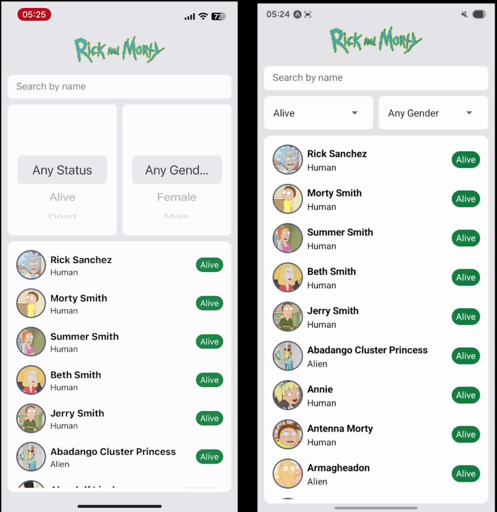
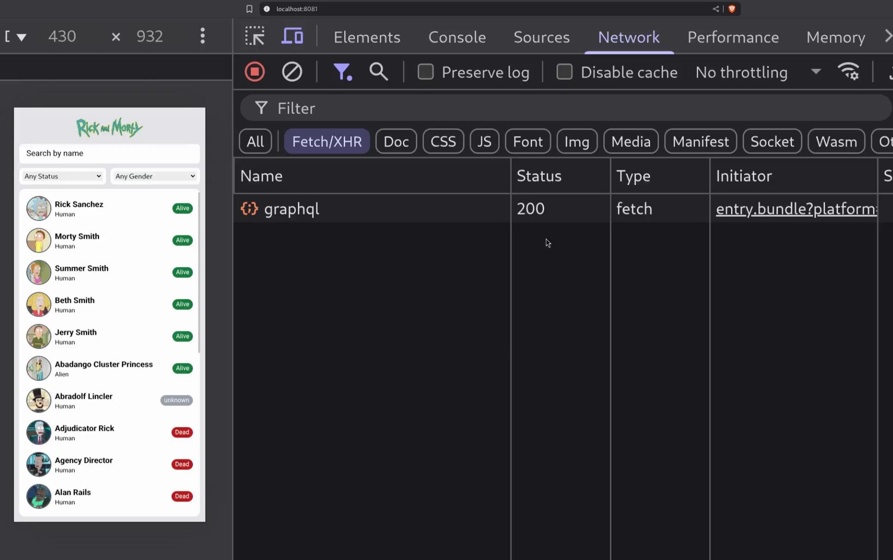
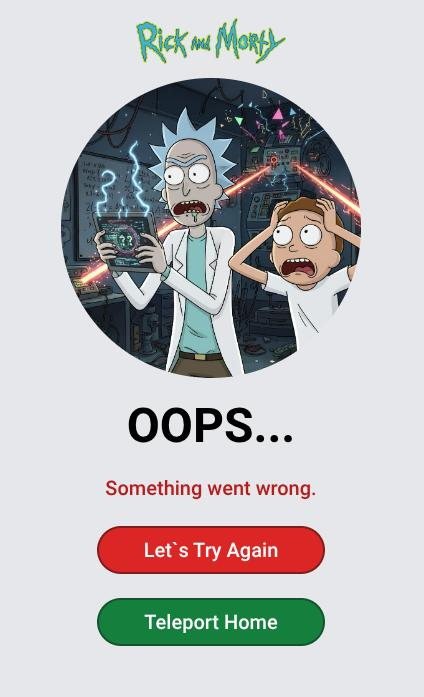
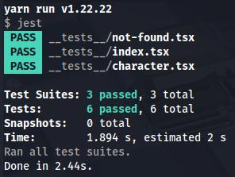

# Rick and Morty Mobile App

#### Tech Stack: Expo SDK 53, Apollo + GraphQL, Infinite Scroll with FlashList, Styling with NativeWind, Tests with Jest

## Demo

#### iOS and Android App Demo ([Click for full video](https://drive.google.com/file/d/1X8BQmSzpd_qNyS9V1DmL0sIwJ4argmxK/view?usp=sharing))

This demonstration showcases the application's high performance and responsiveness on both iOS and Android. The screen recordings were captured on physical devices (iPhone and Samsung) via the Expo Go app to provide a real-world performance benchmark.

Notice the fluid navigation from the character details page back to the list, which is instantaneous as it utilizes cached data. Furthermore, the caching strategy ensures that on the initial visit to a character's page, partial data is loaded instantly from the cache, while subsequent visits retrieve all data locally, eliminating the need for a new network request.

#### Web App Demo ([Click for full video](https://drive.google.com/file/d/1QXLGwZq5IdJlvkTFHsKiLhyhMsdOTMgw/view?usp=sharing))

This demonstration highlights the application's data fetching and caching strategies. To better illustrate the loading process, the network speed has been intentionally throttled. This showcases key features such as partial loading from the cache, the use of placeholder skeletons, and the efficiency of a cache-first policy, which avoids redundant network requests for previously viewed data.

## Instructions

1. Clone the repository
2. Run: `yarn`
3. Run: `yarn start`

## Implementation Details

**1. Apollo Cache**

**1.1.** A custom `merge` function was implemented to combine paginated character results, ensuring uniqueness by filtering based on the `__ref` property. If a character from the next page already exists in the cache, it will be excluded to prevent duplicates.

**1.2.** A custom `read` function was developed using `cache.readFragment` to retrieve cached character details (e.g., name, species, image) from existing query fragments. When navigating to the Character Details screen from the Characters List screen, partial data is loaded from the cache, and any missing data is fetched from the backend. This results in only partial skeleton placeholders being rendered initially.

**2. GraphQL Code Generation**

The graphql-codegen tool is utilized to automatically generate hooks, types, and documents for two queries and one fragment. This eliminates the need for manual code creation and allows for seamless integration and usage throughout the application.

**3. Performance Optimization**

Achieved a consistent 60 FPS and smooth user experience on both devices by leveraging tools such as `Expo Performance Monitor`, `React Native DevTools` (Profiler, Memory, and Network) and `Flipper`.

**4. FlashList**

Configuration of `estimatedItemSize` was required; however, due to lack of support in `FlashList` v2+, the feature was not used.

**5. Advanced Filtering**

In addition to name-based search, filtering options by character status and gender were also implemented.

## Screenshots

#### Error Screen

#### Not Found Screen

## Tests

To run tests just run `yarn test`.

`Characters List`, `Character Details` and `Not Found` screens were covered with tests.

